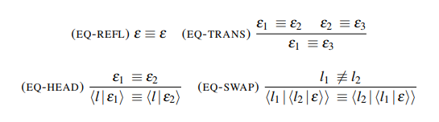
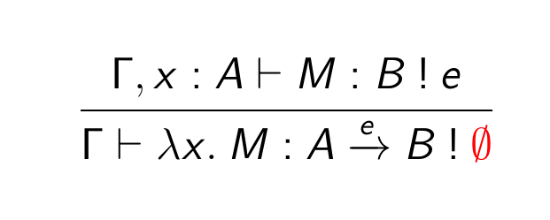
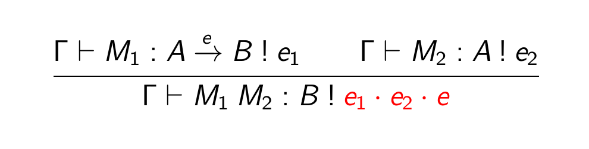
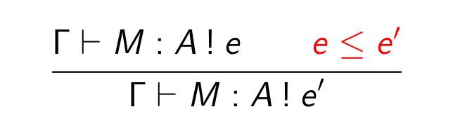

% 'Monads and Effects'
% @myuon
% \today
---
fontsize: 14pt
---

# About me

Twitter: \textcolor{cyan}{@myuon\_myon}

{width=2cm}

# Table of Contents

1. Effect System in General
    - What's the Effect?
    - Example: Memory-state effect
2. Koka
    - Effect in Koka
    - Syntax in Koka
    - Some details
3. Effect as Parametric Monad
    - Structures in Effects
    - Monads and Effects

# Table of Contents

1. \textcolor{magenta}{Effect System in General}
    - What's the Effect?
    - Example: Memory-state effect
2. Koka
    - Effect in Koka
    - Syntax in Koka
    - Some details
3. Effect as Parametric Monad
    - Structures in Effects
    - Monads and Effects

# What's the Effect?

$$\Gamma \vdash M : A \textcolor{red}{\:!\: e}$$

- $\Gamma$: Context
- $M$: Term
- $A$: Type
- $e$: effect

Idea: "The type system estimates the effect of computation $M$ to be (at most) $e$"

# What's the Effect? (Observation)

What effects are potentially caused during the execution?

$\vdash \langle M_1 , M_2 \rangle : A \times B$

$\vdash \textbf{let } x = M \textbf{ in } N : B$

$\vdash \lambda x.\: M : A \to B$

$\vdash (\lambda x.\: M) N : B$

# What's the Effect? (Answer-1)

Let $(\cdot)$ be an "accumulating" operator (or an effect product).

$\vdash \langle M_1^{\textcolor{red}{e_1}} , M_2^{\textcolor{red}{e_2}} \rangle : A \times B \:!\: e_1 \cdot e_2$

$\vdash \textbf{let } x = M^{\textcolor{red}{e_1}} \textbf{ in } N^{\textcolor{red}{e_2}} : B \:!\: e_1 \cdot e_2$

Observation: effects can be stacked

We will discuss the others later.

# Memory-state Effect

Effect $J \subseteq \texttt{Addr}$ means the computation contains $I$ "memory" effect (at most).

- $\vdash \texttt{read}_i() : \texttt{nat} \:!\: \{i\}$
- $n : \texttt{nat} \vdash \texttt{write}_i(n) : 1 \:!\: \{i\}$

\begin{exampleblock}{Example}
$\vdash \textbf{let } x = \texttt{read}_i() \textbf{ in } \texttt{write}_j(x) \: : \: 1 \: ! \: \{i,j\}$
\end{exampleblock}

# Existing Effect System

- \textcolor{red}{Koka}
- Eff
- Frank
- Multicore OCaml
- and more...

What are the effects of those languages?

# Table of Contents

1. Effect System in General
    - What's the Effect?
    - Example: Memory-state effect
2. \textcolor{magenta}{Koka}
    - Effect in Koka
    - Syntax in Koka
    - Some details
3. Effect as Parametric Monad
    - Structures in Effects
    - Monads and Effects

# Koka

Deveoped by Daan Leijen in Microsoft Research since 2012.

> Koka is a function-oriented programming language that seperates pure values from side-effecting computations, where the effect of every function is automatically inferred.

# Koka Base Effects

Computation in Real-world are decomposed into effects:

- $\texttt{exn}$: exception
- $\texttt{div}$: divergence (infinite loop)
- $\texttt{ndet}$: non-determinism (random value)
- $\texttt{alloc(h), read(h), write(h)}$: memory operation ($h$ for some heap)

In Koka, effect order does not matter.

# Koka Effect Aliases

- $\texttt{total} \equiv \langle \rangle$
- $\texttt{pure} \equiv \langle \texttt{exn}, \texttt{div} \rangle$
- $\texttt{st(h)} \equiv \langle \texttt{alloc}(h) , \texttt{read}(h), \texttt{write}(h) \rangle$
- $\texttt{io} \equiv \langle \texttt{st}(io), \texttt{pure}, \texttt{ndet} \rangle$

### Example

- $\texttt{print}: \texttt{string} \xrightarrow{\texttt{io}} 1$
- $\texttt{error}: \forall \alpha.\: \texttt{string} \xrightarrow{\texttt{exn}} \alpha$
- $(\texttt{:=}): \forall \alpha.\: (\texttt{ref}(h,a), a) \xrightarrow{\texttt{write}(h)} 1$

# Koka Syntax* (kind)

kinds:

- $*$: type of values
- $e$: effect rows
- $k$: effect constraints
- $h$: heap
- $\_ \to \_$: constructor

# Koka Syntax* (type)

type:

- $\alpha$: type variable
- $()$: unit type
- $\_ \xrightarrow{e} \_$: function type with effects
- $\texttt{ref}(h,*)$: reference

# Koka Effect Rows*

"Row-polymorphic" effect: $\langle exn \mid \mu \rangle$

Example) $\texttt{catch} : \forall \alpha \mu. \: (1 \xrightarrow{\langle \texttt{exn} \mid \mu \rangle} \alpha, \texttt{exception} \xrightarrow{\mu} \alpha) \xrightarrow{\mu} \alpha$



# Koka ST Types

(Alloc) $\Gamma \vdash \texttt{ref} : \tau \xrightarrow{\langle \texttt{st}(h) \mid \varepsilon \rangle} \texttt{ref}(h,\tau) \:!\: \varepsilon'$

(Read) $\Gamma \vdash (!) : \texttt{ref}(h,\tau) \xrightarrow{\langle \texttt{st}(h) \mid \varepsilon \rangle} \tau \:!\: \varepsilon'$

(Write) $\Gamma \vdash (:=) : (\texttt{ref}(h,\tau), \tau) \xrightarrow{\langle \texttt{st}(h) \mid \varepsilon \rangle} 1 \:!\: \varepsilon'$

(Run) $\Gamma \vdash e : \tau \:!\: \langle \texttt{st}(h) \mid \varepsilon \rangle \Longrightarrow \Gamma \vdash \texttt{run}(e) : \tau \:!\: \varepsilon$

# Koka ST Types (Fib Example)

```js
function fib(n: int) {
  val x = ref(0); val y = ref(1);
  repeat(n) {
    val y0 = !y;
    y := !x + !y;
    x := y0;
  }
  !x
}
```

$\vdash \texttt{fib} : \texttt{int} \xrightarrow{\texttt{st}(h)} \texttt{int} \:!\: \emptyset$

# Koka Effects** (Effect Duplication)

Allows effect duplication: $\langle \texttt{exn}, \texttt{exn} \rangle \not \equiv \langle \texttt{exn} \rangle$

Thanks to effect equivalence and the effect duplication, Koka can solve the following equation.

$$ \langle \texttt{exn} \mid \mu \rangle \equiv \langle \texttt{exn} \rangle \Longrightarrow \mu \equiv \langle \rangle$$

# Table of Contents

1. Effect System in General
    - What's the Effect?
    - Example: Memory-state effect
2. Koka
    - Effect in Koka
    - Syntax in Koka
    - Some details
3. \textcolor{magenta}{Effect as Parametric Monad}
    - Structures in Effects
    - Monads and Effects

# What's the Effect? (Answer-2)

{width=5.5cm}

{width=9cm}

# Laws in Effect System (Monad)

Effect can be viewed as "Parametric" computation.  
$\Longrightarrow$ So does the laws?

Monad laws:

- (assoc) $(\textbf{let } x = M \textbf{ in } (\textbf{let } y = N \textbf{ in } L)) \equiv (\textbf{let } y = (\textbf{let } x = M \textbf{ in } N) \textbf{ in } L$
- (left id) $(\textbf{let } x = x \textbf{ in } M) \equiv M$
- (right id) $(\textbf{let } x = M \textbf{ in } x) \equiv M$

# Laws in Effect System**

For $(\textbf{let } x = x \textbf{ in } M^e) \equiv M^e$, we should assume:

- Variable $x$ has no effect, namely $\emptyset$
- Right-hand side, the effect is $e$
- Left-hand side, the effect should be $\emptyset \cdot e$

We should have left identity law of effect: $\emptyset \cdot e = e$

# Inevitable Over-estimation*

Effect system estimates its effect of the computation.  

$\Longrightarrow$ Compiler can always estimate the correct effect?

$\Longrightarrow$ The answer is "No"

$$\vdash (\textbf{if}\: x = 0 \:\textbf{then}\: \texttt{raise} \: \text{"error"} \:\textbf{else}\: x) : \texttt{nat} \:!\: \{ \texttt{exn} \}$$


{width=5cm}

# Structure in Effects

Let $\mathbb{E}$ be an effect set.

- Have an unit $\emptyset \in \mathbb{E}$
- Have a binary operator $(\cdot) : \mathbb{E} \times \mathbb{E} \to \mathbb{E}$
- $\langle \mathbb{E}, (\cdot), \emptyset \rangle$ is a monoid
- Have a preorder $(\leq) \subseteq \mathbb{E} \times \mathbb{E}$
- The (monoid/preorder) operators are compatible

# Memory-state Monad

Monad $T(-)$ means the computation contains some "memory" effect. (like $\texttt{IO}$ in Haskell)

We have memory operations:

- $\vdash \texttt{read}_i () : T\texttt{nat}$
- $n : \texttt{nat} \vdash \texttt{write}_i (n) : T1$

# Memory-state Effects Structure

Let $\texttt{Addr}$ be a set of addresses. In this example, an effect set is $\mathcal{P}(\texttt{Addr})$.

- $\emptyset$: The emptyset
- $(\cdot) = (\cup)$: The union of sets
- $(\leq) = (\subseteq)$: Set inclusion

# "Parametric" Memory-state (Semantics)

Let $\textcolor{cyan}{\texttt{Mem}(J)}$ be the memory state which the address set $J$ might be modified from the initial state.

$$T_I(A) = \forall J \in \mathcal{P}(\texttt{Addr}).\: \texttt{Mem}(J) \to (\texttt{Mem}(I \cup J) \times A)$$

Interpret $\Gamma \vdash M \: : \: A \: ! \: e$ as $\overline{M} : \overline{\Gamma} \to T_e (\overline{A})$

- $\texttt{read}_i : 1 \to T_{\{i\}} \texttt{nat}$
- $\texttt{write}_i : \texttt{nat} \to T_{\{i\}} 1$

# Further topics

- Semantics
- Graded Monad (for the formal semantics)
- Recursion
- Algebraic Effects and Effect Handlers
- Effect Inference
- Polymorphic Effect

# Recursion**

$$\vdash \texttt{map} : (A \xrightarrow{e} B) \to (\texttt{List}(A) \xrightarrow{???} \texttt{List}(B))$$

# Recursive Effects**

$$\vdash \texttt{map} : (A \xrightarrow{e} B) \to (\texttt{List}(A) \xrightarrow{???} \texttt{List}(B))$$

### Simple idea

Introduce (possibly many-times) multiplied effect, $e^\dagger$.  
Then, how do we give the semantics of the fixpoint?

$$\texttt{mfix}: (A \xrightarrow{e} A) \xrightarrow{e^\dagger} A$$

# References

- \small{Daan Leijen. 2016. ``Koka: Programming with Row-polymorphic Effect Types''}
- \small{Shin-ya Katsumata. 2014. ``Parametric effect monads and semantics of effect systems''}
- \small{Andrej Bauer and Matija Pretnar. 2012. ``Programming with Algebraic Effects and Handlers''}
- \small{Sam Lindley, Conor McBride, Craig McLaughlin. 2016. ``Do Be Do Be Do''}
